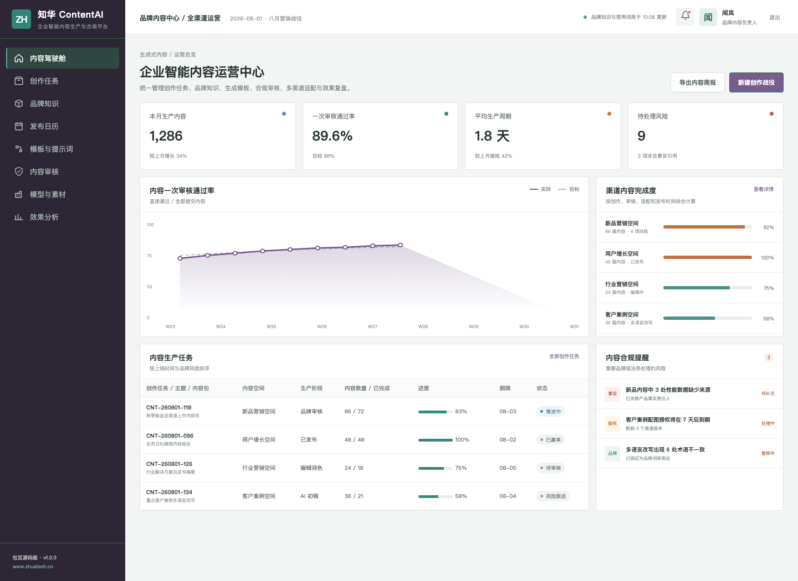
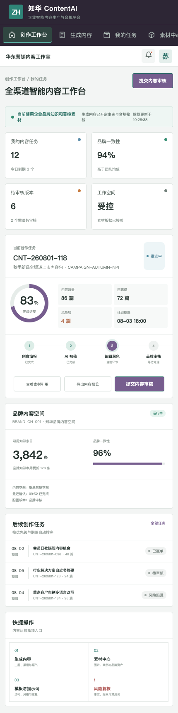

# ZhuaTech ContentAI

## 企业智能内容生产与合规平台

创作效率、品牌一致性和内容安全不应彼此牺牲。ZhuaTech ContentAI 把企业知识、生成式 AI、素材版权和多级审核连接为可管理的内容生产线。

[官网](https://www.zhuatech.cn/)　[部署](deploy/README.md)　[接口](docs/api.md)　[授权](LICENSE)



### 一套可审计的内容工厂

- 从创意简报生成多版本内容草稿
- 绑定产品事实、品牌术语和素材来源
- 执行事实、禁用词、隐私、版权和相似度检查
- 支持编辑、品牌、法务多角色审核
- 面向官网、公众号、社媒、邮件等渠道自动适配
- 跟踪生产周期、审核通过率和渠道效果



发布门禁现已覆盖个人信息、企业禁用词和事实引用完整性。审核接口会给出 `PASS`、`REVIEW` 或 `BLOCK` 结论、量化风险分以及逐项整改原因，适合嵌入编辑器保存、渠道发布和法务复核流程。

### 技术实现

```text
Vue 3 管理端/H5 → Spring Boot API → 业务流程与审计 → MySQL
                                      ↘ AiProvider / 内容生成服务
```

后端基于 Java 21、Spring Security、JWT、JPA、Flyway，包名为 `cn.zhuatech.contentai`；前端采用 Vue 3、Pinia、Vue Router、Axios 与 Vite。演示 AI Provider 不联网、不保存真实密钥，可由实施方接入企业批准的模型服务。

```bash
cd frontend && npm install && npm run dev:demo
```

访问 `http://localhost:5173`。`planner / Demo@2026` 进入内容运营中心，`operator / Demo@2026` 进入创作工作台。演示品牌、内容、素材和指标均为虚构数据。

### 使用许可和商业合作

本工程由上海如静知华信息科技有限公司发布，仅限个人学习、研究及非商业技术交流，**不得商用**。企业部署、生产使用、SaaS、项目交付、收费培训、品牌替换、商业再发行等行为必须取得我方书面授权，详见 [LICENSE](LICENSE)。

深度定制、私有化部署与商业授权，请联系[知华科技](https://www.zhuatech.cn/)：

| 微信咨询 | 微信咨询 |
| --- | --- |
|  |  |

SEO 关键词：AI 内容生成系统源码、企业内容中台、品牌内容审核、生成式 AI 平台、Java ContentAI、Vue 内容管理、知华科技。
